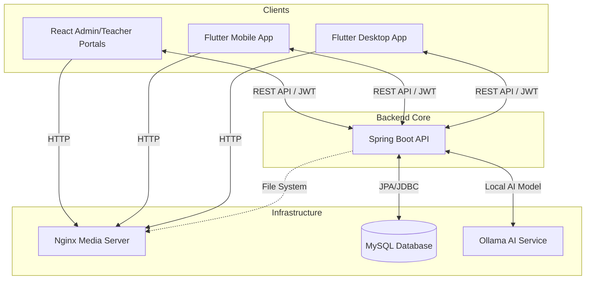

# 📘 IELTS Learning Platform - Master Documentation

Welcome to the official documentation for the **IELTS Learning Platform**. This document provides a comprehensive overview of the system architecture, core modules, technology stack, and operational guides for developers and stakeholders.

---

## 🚀 1. Project Overview

The **IELTS Learning Platform** is an end-to-end educational ecosystem designed to streamline English language learning and IELTS exam preparation. It empowers students with AI-driven feedback while providing teachers and administrators with robust management tools.

### 👥 Primary User Groups

- **Students (Customers)**: Learn and practice across all four IELTS skills (Listening, Reading, Writing, Speaking) via mobile and desktop apps.
- **Teachers**: Create content, manage curriculum, and provide human-graded feedback.
- **Administrators**: Oversee the platform, manage users, monitor the i-Coin economy, and generate performance reports.

---

## 🏗️ 2. System Architecture

The platform follows a modern, distributed architecture to ensure scalability and cross-platform accessibility.

### 🌐 High-Level Communication



### 💻 Technology Stack

| Layer | Technology | Key Features |
| :--- | :--- | :--- |
| **Backend** | Java 17, Spring Boot 3.5 | Vertical Slice Architecture, Spring Security (JWT), WebSockets. |
| **Web Frontend** | React 18, TypeScript, Tailwind | Turborepo Monorepo, Zustand State Management, TanStack Query. |
| **Mobile/Desktop** | Flutter SDK (^3.10) | Modular Layered Architecture, Provider State Management. |
| **AI Engine** | Ollama (Gemma 3) | Locally-hosted LLM for grading, essay feedback, and vocabulary practice. |
| **Infrastructure** | MySQL 8.0, Nginx, Docker | Efficient media serving, relational data consistency. |

---

## 📂 3. Core Modules

### 🛡️ Identity & Security

- **Authentication**: JWT-based auth with support for email/password and Google OAuth2.
- **Roles**: CUSTOMER, TEACHER, ADMIN with granular permissions.
- **Profile Management**: Comprehensive user profiles, including avatar uploads and moderation.

### ✍️ Writing & AI Grading

- **AI Feedback**: Intent-driven grading using Ollama, providing immediate band scores and improvement suggestions.
- **Human Grading (Teaching Zone)**: Teachers can access the **Grading Queue** to claim student submissions and provide detailed qualitative feedback through a specialized workspace.
- **Topic Bank**: Categorized writing prompts for Task 1 and Task 2.

### 📊 Quiz Bank & Exams

- **Full Mock Exams**: Complete IELTS simulations covering all sections.
- **Skill-Based Practice**: Targeted exercises for Reading, Listening, and Vocabulary.
- **Smart Test**: AI-generated quizzes tailored to student performance levels.

### 💰 i-Coin Economy

- **Virtual Currency**: Users earn or purchase i-Coins for premium content access.
- **Subscriptions**: Pro memberships for unlimited AI attempts and advanced features.

### 💬 Real-Time Interactions (Chat)

- **Teacher-Admin Support**: Dedicated WebSocket-based chat for internal communication.
- **Notifications**: Global announcement system for policy updates and platform news.

---

## 🛠️ 4. Development Guides

### 📂 Repository Structure

```text
eproject4/
├── backend/                # Vertical Slice Java Backend
├── frontend-web/           # Turborepo (Admin & Teacher Apps)
├── mobile-desktop/         # Cross-platform Flutter Application
├── database/               # SQL Initialization Scripts
└── nginx/                  # Media Server Configuration
```

### 🏃 Quick Start (Local Setup)

1. **Database**:
   - Create a database `eproject4` in MySQL.
   - Import the dump from `database/eproject4_dump.sql`.
2. **Backend**:
   - `cd backend && ./mvnw spring-boot:run`
3. **Web**:
   - `cd frontend-web && npm install && npm run dev`
4. **Flutter**:
   - `cd mobile-desktop && flutter run`
5. **Infrastructure**:
   - `docker-compose up -d` (Starts the Nginx Media Server).

---

## 📜 5. Future Roadmap & Improvements

[!NOTE]
Future enhancements include Speaking Section AI integration through real-time audio transcription and advanced performance analytics for institutional partners.

1. **AI Speaking Evaluation**: Integration with Whisper/TTS for real-time practice.
2. **Offline Mode**: Local caching of exam materials for mobile users.
3. **Gamification**: Leaderboards and achievement badges to increase engagement.

---

> Documentation generated by **Antigravity AI**. Last updated: April 6, 2026.
