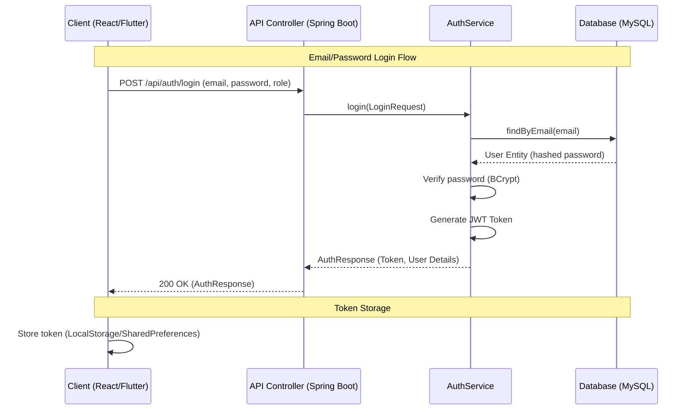
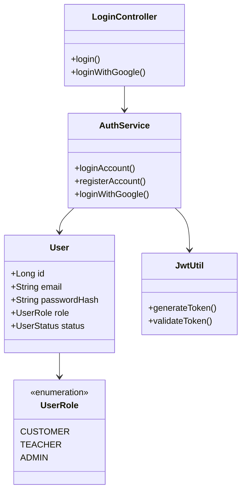

# Login Feature Technical Documentation

## 1. Metadata
- **Title**: Cross-Platform Login Feature Documentation
- **Author**: Antigravity AI
- **Creation Date**: 14/03/2026

---

## 2. Architecture & UML Sequence Diagram

The authentication system follows a centralized approach using JWT (JSON Web Tokens). The backend serves as the single source of truth for identity management, supporting both traditional email/password and Google OAuth2 flows.

### End-to-End Authentication Flow

### Token Lifecycle
- **Generation**: Created by `JwtUtil` upon successful credentials verification. It contains claims like username, role, and expiration date.
- **Validation**: Every incoming request to protected endpoints is intercepted by `JwtFilter`, which extracts the token from the `Authorization` header and validates it using the secret key.
- **Storage**:
    - **Web**: Stored in `localStorage` (e.g., `admin_token`, `teacher_token`).
    - **Mobile**: Persisted using `shared_preferences` (key: `auth_token`).
- **Expiration**: Tokens typically have a TTL (Time To Live). Once expired, the user is required to re-authenticate.

---

## 3. Backend (Java Spring Boot)

The backend handles security using Spring Security and JWT.

### Core Backend Entities

### Security Details
- **Configurations**: `SecurityConfig` defines the security filter chain, cross-origin resource sharing (CORS), and disables CSRF for stateless API interactions.
- **Verification**: Uses `BCryptPasswordEncoder` for hashing and matching passwords.
- **Endpoints**:
    - `POST /api/auth/login`: Primary authentication endpoint.
    - `POST /api/auth/login/google`: Google ID token verification.

---

## 4. Web App (React Frontend)

The web apps (Admin and Teacher) utilize a modern React stack.

- **UI Components**: Login screens (`Login.tsx`) feature a clean design with form validation (React state) and loading indicators.
- **Form Submission**: Uses `apiClient` (Axios wrapper) to send credentials to the backend. Role-specific login ensures users only access their designated area.
- **State Management**:
    - After login, the JWT is stored in `localStorage`.
    - `navigate()` from `react-router-dom` redirects users to the dashboard.
    - Subsequent requests include the token in headers via Axios interceptors.

---

## 5. Mobile App (Flutter)

The mobile application provides a streamlined experience for students/customers.

- **Screens**: Developed using Flutter widgets (`LoginScreen`, `RegisterScreen`). `CustomTextField` and `CustomButton` are used for a consistent UI.
- **API Integration**: The `AuthApi` service handles all HTTP requests to the backend. It uses the `http` package and environment variables for the base URL.
- **Secure Storage**: Tokens are saved locally using `shared_preferences` under the key `auth_token`. It also tracks user-specific flags like `is_pro`.

---

## 6. Error Handling

Proper error propagation ensures a good user experience even when things go wrong.

### Common Failure States
| HTTP Status | Error Type | Explanation | Surface Logic |
| :--- | :--- | :--- | :--- |
| **401** | Unauthorized | Invalid email or password. | Displays "Invalid credentials" toast/snackbar. |
| **403** | Suspended | Account is locked or suspended. | Shows "Your account has been suspended" message. |
| **400** | Bad Request | Missing fields or invalid email format. | Client-side validation shows inline errors. |
| **500** | Server Error | Database or network connection issue. | Displays "Authentication failed" or "Connection error". |

**Surfacing Errors**:
- **Web**: Uses `setError` state to display red alert boxes above the login form.
- **Mobile**: Uses `ScaffoldMessenger` to show `SnackBar` notifications with descriptive error messages.
