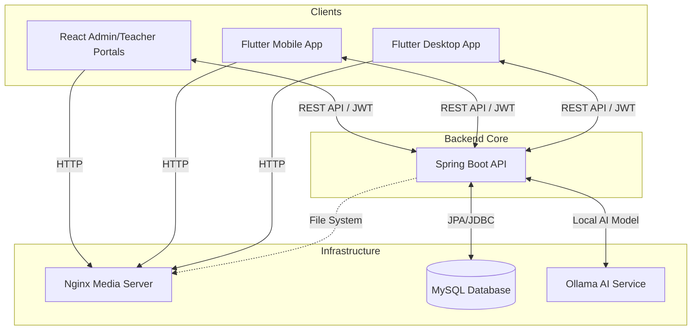
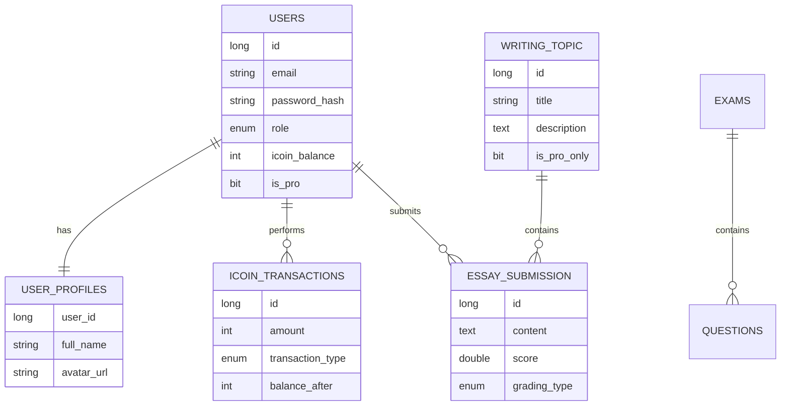

# Master System Architecture

## 1. System Overview
The **IELTS Learning Platform** is a comprehensive solution designed to facilitate English language learning and IELTS exam preparation. The system serves three distinct user groups:
- **Students (Customers)**: Access the platform via mobile and desktop applications to study listening, reading, writing, speaking, and vocabulary. Features include AI-powered grading for writing and practice exams.
- **Teachers**: Manage educational content, create questions, and grade student submissions through a dedicated web portal.
- **Administrators**: Oversee the entire platform, manage users, monitor financial transactions (i-Coin), and generate reports via the Admin Dashboard.

The core business logic revolves around a robust **Quiz Bank** for exam preparation, an **i-Coin** economy for premium features, and **AI-driven feedback** using fine-tuned LLMs (Ollama) to provide immediate grading and suggestions to learners.

---

## 2. Technology Stack
The platform is built on a modern, distributed architecture ensuring scalability and cross-platform accessibility.

### Backend (Java Spring Boot)
- **Runtime**: Java 17
- **Framework**: Spring Boot 3.5.9
- **Security**: Spring Security (JWT-based, `jjwt` 0.11.5), Google OAuth2 (`google-api-client` 2.2.0)
- **Data Access**: Spring Data JPA with MySQL Connector-J
- **Task Management**: Lombok for boilerplate reduction
- **Communication**: WebSockets for real-time interactions
- **Rate Limiting**: Bucket4j (v8.10.1)
- **Excel Processing**: Apache POI (v5.3.0)
- **Utility**: Datafaker (v2.4.2) for development data seeding

### Web Frontend (React)
- **Runtime**: Node.js 20+
- **Framework**: React 18.2.0 (TypeScript 5.2.2)
- **Build Tool**: Vite 5.1.4 within a Turborepo monorepo
- **State Management**: Zustand 5.0.11
- **Data Fetching**: TanStack React Query 5.20.0
- **Styling**: Tailwind CSS 3.4.1
- **UI Components**: Lucide React
- **Routing**: React Router Dom 7.13.1

### Mobile & Desktop Clients (Flutter)
- **Runtime**: Flutter SDK (^3.10.1)
- **State Management**: Provider 6.1.2
- **Networking**: http 1.6.0
- **Auth**: google_sign_in 6.2.1
- **Storage**: shared_preferences 2.2.3 and flutter_dotenv 5.1.0
- **Media**: just_audio 0.9.36, audioplayers 5.2.1, and flutter_tts 3.8.5

### Infrastructure
- **Database**: MySQL 8.0
- **Media Server**: Nginx (Dockerized) for static file serving
- **AI Service**: Ollama (Running Gemma 3-4b)

---

## 3. High-Level Architecture
The following flowchart illustrates the macro-level communication between system components:



---

## 4. Core Modules & Directory Structure
The repository is organized into a modular structure to support the multi-stack nature of the project.

| Directory | Description |
| :--- | :--- |
| `backend/` | Spring Boot application following Vertical Slice Architecture. Organizes code by features (Auth, Quiz Bank, i-Coin). |
| `frontend-web/` | Turborepo monorepo containing the Admin and Teacher React applications and shared packages. |
| `mobile-desktop/` | Single Flutter codebase targeting Android, iOS, Windows, and MacOS. |
| `database/` | Contains SQL migration scripts and database initialization dumps. |
| `nginx/` | Configuration and setup for the media-serving layer via Docker. |
| `document/` | Technical documentation and architectural guides. |

---

## 5. Database Schema Overview
The system utilizes a relational database to maintain consistency across educational and financial data.



---

## 6. Local Setup & Build Instructions

### Ngày khởi tạo: 14/03/2026

#### 1. Database Setup
- Cài đặt MySQL 8.0.
- Tạo database `eproject4`.
- Import dữ liệu: `mysql -u root -p eproject4 < database/eproject4_dump.sql`.

#### 2. Backend (Spring Boot)
1. Cấu hình `backend/src/main/resources/application.properties`.
2. Chạy lệnh:
   ```bash
   cd backend
   ./mvnw spring-boot:run
   ```

#### 3. Web Frontend (React)
1. Cài đặt dependencies từ thư mục gốc:
   ```bash
   cd frontend-web
   npm install
   ```
2. Chạy môi trường phát triển:
   ```bash
   npm run dev
   ```

#### 4. Mobile & Desktop (Flutter)
1. Tạo file `.env` từ `.env.example` trong thư mục `mobile-desktop`.
2. Chạy lệnh:
   ```bash
   cd mobile-desktop
   flutter pub get
   flutter run
   ```

#### 5. Media Server (Nginx)
Đảm bảo Docker Desktop đang chạy, sau đó từ thư mục gốc:
```bash
docker-compose up -d
```
